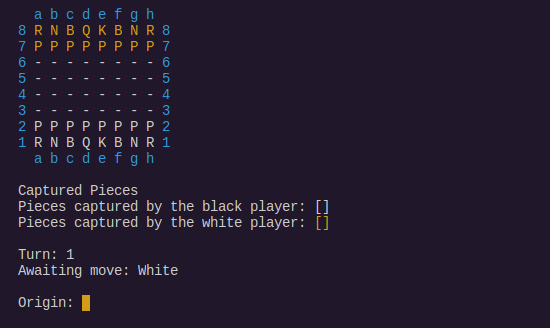
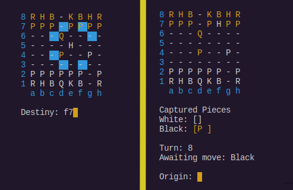
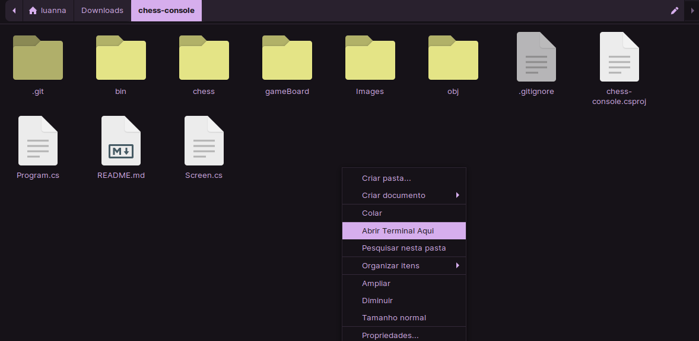
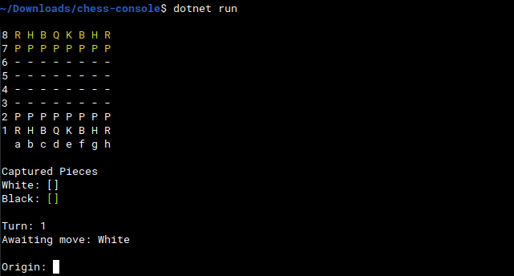
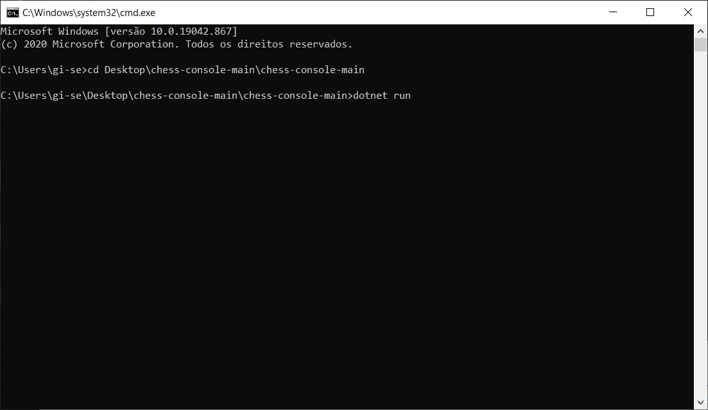
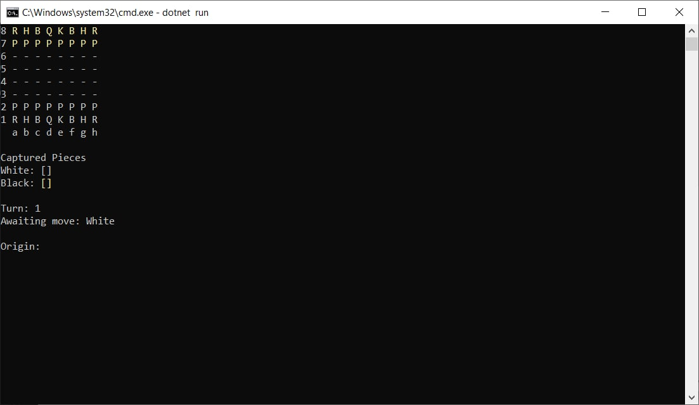

# CHESS-CONSOLE :chess_pawn:
Famoso jodo de xadrez, feito com C#, disponível para jogar pelo terminal.
No qual o tabuleiro é organizado em linhas de 8 a 1 e colunas de "a" até "h", sendo possível ter o controle de quais peças foram capturadas, qual turno se encontra e de qual jogador é a vez.

## Peças
* R (_ROOK_) : TORRE
* H (_KNIGHT_ / _HORSE_) : CAVALO
* B (BISHOP) : BISPO
* Q (_QUEEN_) : RAINHA / DAMA
* K (_KING_) : REI
* P (_PAWN_) : PEÃO

O jogador indica a peça que deseja mover em _origin_, no estilo batalha naval, desta maneira será indicado para quais lugares a peça poderá mover, o jogador digita o local de destino em _destiny_, dando continuidade ao jogo.

# COMO TESTAR :joystick:
## Passo 01
Faça o download deste repositório como zip e descompacte no lugar desejado.

## Passo 02
Primeiro, certifique-se que o DOTNET está instalado!

(<a href="https://docs.microsoft.com/pt-br/dotnet/core/install/linux-ubuntu">Clique aqui para baixá-lo (LINUX-UBUNTU)</a>).

(<a href="https://docs.microsoft.com/pt-br/dotnet/core/install/linux-ubuntu">Clique aqui para baixá-lo (WINDOWS)</a>).

## Passo 03
### No linux
Após realizar o download do repositório e dotnet, abra a pasta correspondente. Estando com a mesma aberta, clique com o botão direito, seguidamente, em "Abrir terminal aqui", digite "dotnet run".

Está pronto para começar a jogar!

### No windows
Após realizar o download da pasta e do dotnet, abra o pront de comando e digite manualmente, utilizando o comando _cd_, o diretório em que a pasta se encontra (Exemplo: _cd Desktop\chess-console-main\chess-console-main_), pressione enter e, por fim, escreva "dotnet Run".

Está pronto para começar a jogar!

##### Você também pode escolher a IDE de sua preferência.