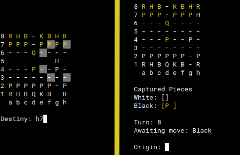

# CHESS-CONSOLE :chess_pawn:
Famoso jodo de xadrez, feito com C#, disponível para jogar pelo terminal.
No qual o tabuleiro é organizado em linhas de 8 a 1 e colunas de "a" até "h", sendo possível ter o controle de quais peças foram capturadas, qual turno se encontra e de qual jogador é a vez.

O jogador indica a peça que deseja mover em _origin_, será indicado para quais lugares a peça poderá mover, onde o jogador digita o local de destino dando continuidade ao jogo.

# COMO RODAR :joystick:
### Linux
Certifique-se que o DOTNET está instalado (<a href="https://docs.microsoft.com/pt-br/dotnet/core/install/linux-ubuntu">Clique aqui</a>).

Faça o download do repositório e abra a pasta correspondente. Estando com a mesma aberta, clique com o botão direito e em seguida em "Abrir terminal aqui", digite "dotnet run".

### Windows
Certifique-se que o DOTNET está instalado (<a href="https://docs.microsoft.com/pt-br/dotnet/core/install/windows?tabs=net50">Clique aqui</a>i).

