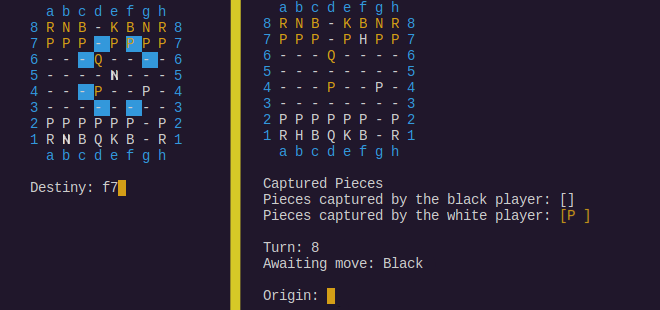
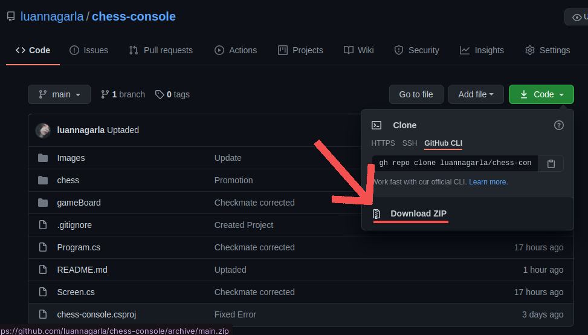
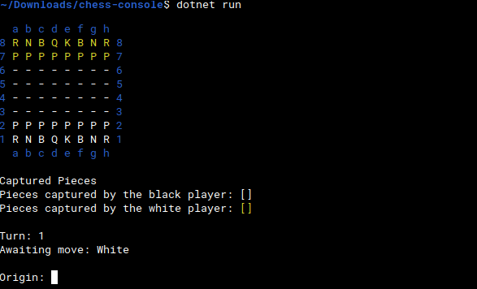

# CHESS-CONSOLE :chess_pawn:
Famoso jodo de xadrez, feito com C#, disponível para jogar pelo terminal.
No qual o tabuleiro é organizado em linhas de 8 a 1 e colunas de "a" até "h", sendo possível ter o controle de quais peças foram capturadas, qual turno se encontra e de qual jogador é a vez.

## Peças
* R (_ROOK_) : TORRE
* H (_KNIGHT_ / _HORSE_) : CAVALO
* B (BISHOP) : BISPO
* Q (_QUEEN_) : RAINHA / DAMA
* K (_KING_) : REI
* P (_PAWN_) : PEÃO

O jogador indica a peça que deseja mover em _origin_, no estilo batalha naval, desta maneira será indicado para quais lugares a peça poderá mover, o jogador digita o local de destino em _destiny_, dando continuidade ao jogo.

# COMO TESTAR :joystick:
## Passo 01 - Baixar a pasta do repositório
Volte ao topo da página, faça o download deste repositório como zip e descompacte, de preferência em _Downloads_.

## Passo 02 - Baixar o dotnet
Certifique-se que o DOTNET está instalado!

<a href="https://docs.microsoft.com/pt-br/dotnet/core/install/linux-ubuntu">Clique aqui para baixá-lo (LINUX-UBUNTU)</a>

<a href="https://docs.microsoft.com/pt-br/dotnet/core/install/linux-ubuntu">Clique aqui para baixá-lo (WINDOWS)</a>

## Passo 03 - Rodar utilizando o dotnet
### No linux
Após realizar o download do repositório e dotnet, abra a pasta correspondente. Estando com a mesma aberta, clique com o botão direito, seguidamente, em "Abrir terminal aqui", digite "dotnet run".

Está pronto para começar a jogar!

### No windows
Após realizar o download da pasta e do dotnet, abra o pront de comando e digite, manualmente, o diretório onde a pasta se encontra.

_Se você não sabe qual é o diretório, clique com o botão direito em cima da pasta, depois em "propriedades", no campo "Local" o mesmo vai estar descrito._

Sabendo qual diretório será escrito, no pront de comando, digite _cd_ + espaço + o diretório + nome da pasta (Como nesse exemplo: _cd Downloads\chess-console-main_), lembrando que NÃO tem necessidade de escrever "C:\Users\Usuário", uma vez que o terminal já indica estar nesse diretório.

No exemplo acima, é possível notar que o terminal já se encontrava em "C:\Users\Usuário", sendo necessário apenas adicionar "cd Donwloads", conforme indicado na propriedade da pasta, e o nome da pasta que foi descompactada.
Seguidamente, pressione enter e, por fim, escreva, em minúsculo, "dotnet run".

Está pronto para começar a jogar!

_Pode ocorrer de aparecer algumas informações sobre o dotnet ao solicitar "dotnet run", se isso ocorrer aperte tecla direcional para cima e enter._

##### Você também pode escolher a IDE de sua preferência.